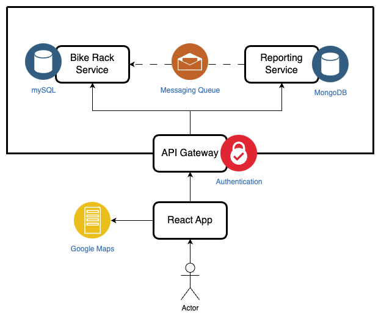

## Bike Rack Finder (Summer Of Shipping)

### Overview
A bicycle rack finding app using data from the City of Vancouver. I made this to solve the problem of figuring out where to lock up my bike without having visited an area before. As well, this app incorporates user reported thefts and bike rack ratings to help gage whether you want to use a rack.

### Bike Rack Finder Demo

### User Stories
As a user I want to:
* view bikes racks on a map
* find the closest bike rack to a given location
* view the number of recent thefts for a bike rack
* view the rating of a bike rack
* report thefts from a bike rack
* report the addition/removal of bike racks
* submit a rating for a bike rack

### Libraries and Technologies Used
| Technology             | Description                                                                                        | License                                                                                         |
|------------------------|----------------------------------------------------------------------------------------------------|-------------------------------------------------------------------------------------------------|
| Spring Boot            | A framework for building Java-based enterprise applications.                                       | [Apache License 2.0](https://www.apache.org/licenses/LICENSE-2.0)                               |
| Maven                  | A Java build automation tool.                                                                       | [Apache License 2.0](https://www.apache.org/licenses/LICENSE-2.0)                               |
| Hibernate              | An object-relational mapping (ORM) tool.                                                             | [GNU Lesser General Public License (LGPL), version 2.1 or later](https://www.gnu.org/licenses/lgpl-3.0.html) |
| MySQL                  | A relational database management system.                                                             | [GPL 2.0 with FOSS License Exception](https://dev.mysql.com/doc/refman/5.7/en/licenses.html)   |
| Flyway                 | A database migration tool.                                                                          | [Apache License 2.0](https://www.apache.org/licenses/LICENSE-2.0)                               |
| MongoDB                | A NoSQL database program.                                                                           | [Server Side Public License (SSPL)](https://www.mongodb.com/licensing/server-side-public-license) |
| RabbitMQ               | An open-source message-broker software.                                                              | [Mozilla Public License 1.1](https://www.rabbitmq.com/mpl.html)                                |
| Logback                | A logging framework for Java applications.                                                           | [GNU Lesser General Public License (LGPL), version 2.1 or later](https://www.gnu.org/licenses/lgpl-3.0.html) |
| Docker                 | A platform for developing, shipping, and running applications inside containers.                     | [Apache License 2.0](https://www.apache.org/licenses/LICENSE-2.0)                               |
| Keycloak               | An open-source identity and access management solution.                                              | [Apache License 2.0](https://www.apache.org/licenses/LICENSE-2.0)                               |
| React                  | A JavaScript library for building user interfaces.                                                   | [MIT License](https://opensource.org/licenses/MIT)                                             |
| Vite                   | A React build tool.                                                                                 | [MIT License](https://opensource.org/licenses/MIT)                                             |
| Chakra UI              | A simple, modular, and accessible component library for React applications.                          | [MIT License](https://opensource.org/licenses/MIT)                                             |
| React Query            | Hooks for fetching, caching, and updating asynchronous data in React.                                | [MIT License](https://opensource.org/licenses/MIT)                                             |
| React Google Maps      | React components for the Google Maps JavaScript API.                                                 | [MIT License](https://opensource.org/licenses/MIT)                                             |
| Marker Clusterer       | A library for clustering markers on Google Maps.                                                     | [Apache License 2.0](https://www.apache.org/licenses/LICENSE-2.0)                               |